> Hello. Please read through the comments we have left on your design plan and make sure to make changes to your design plan and website based on the feedback we give you.
> Comments are listed inside block quotes like this, so make sure to look carefully!
> If a section in your design plan doesn’t have block quotes, then you’re good to go for that section! If there are block quotes, there’s a good chance you’ve missed something crucial.

# Project 3 - Design & Plan

Your Name: Alan Nguyen

## 1. Persona

I've selected **[Abby]** as my persona.

I've selected my persona because she is the most similar to me and I can relate with her the easiest. I also think that Abby represents the biggest portion of the population and want to create a web page that can cater to as many people as possible.

Abby's low computer self-efficacy warrants error messages that allow her to know what the issue is rather than the issue being
her, and her comprehension style warrants the directions/summaries of complex sections so that she can get an overall idea.

>Also specify more about her different parts of her persona and how that will affect your design choices for your site.

## 2. Sketches & Wireframes

### Sketches

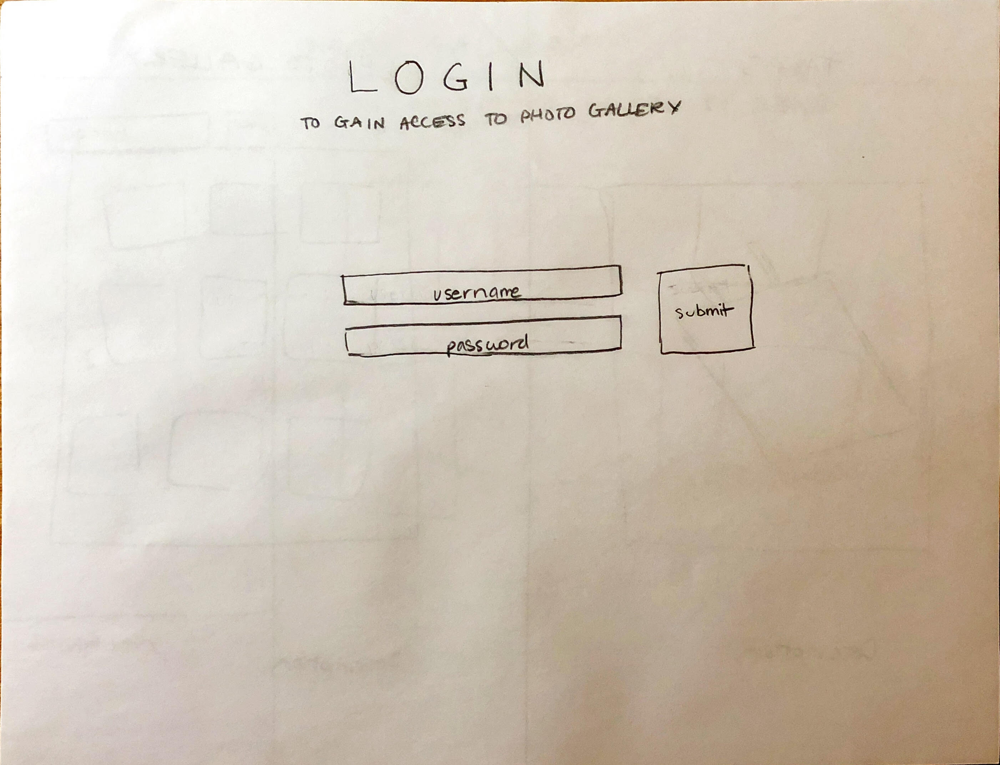

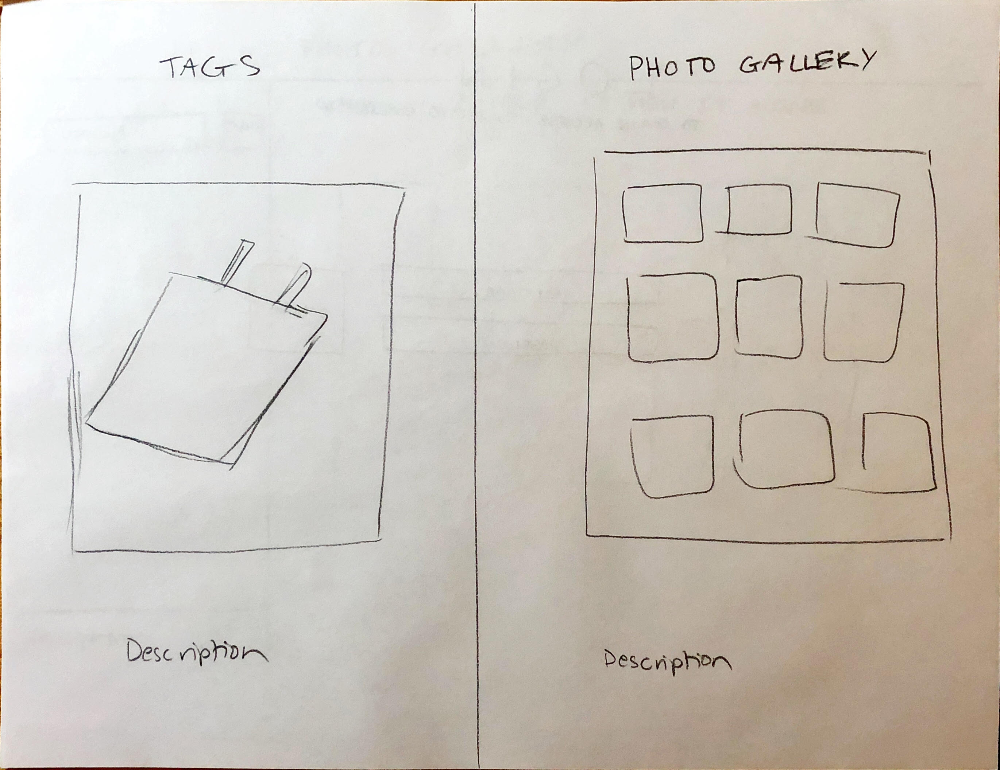

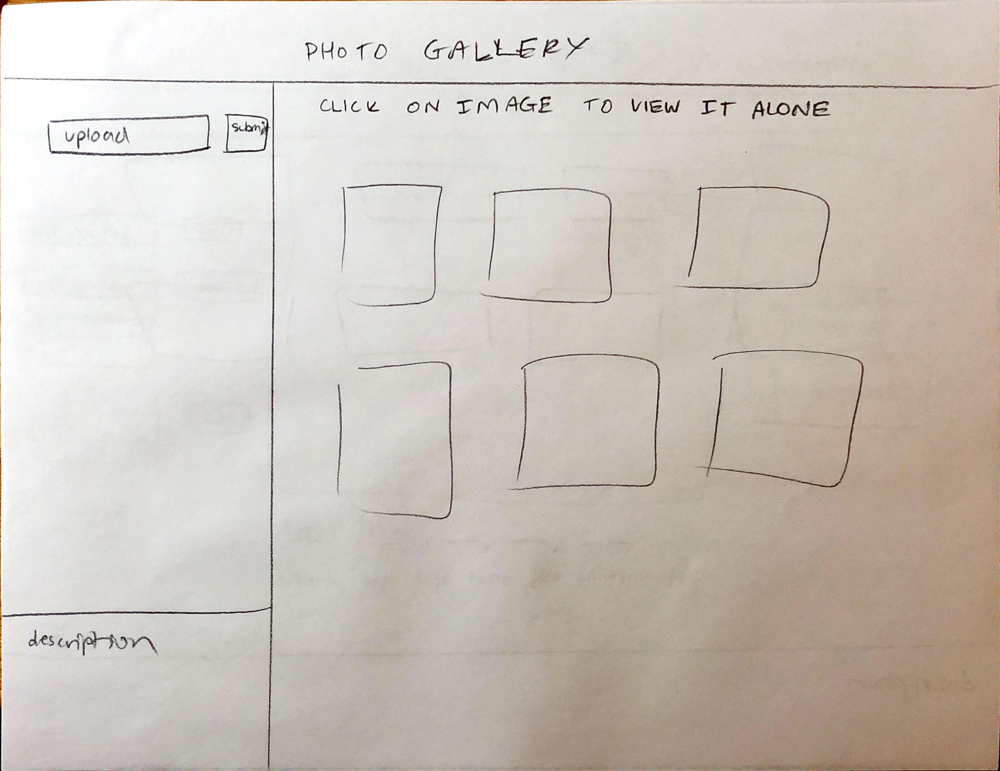

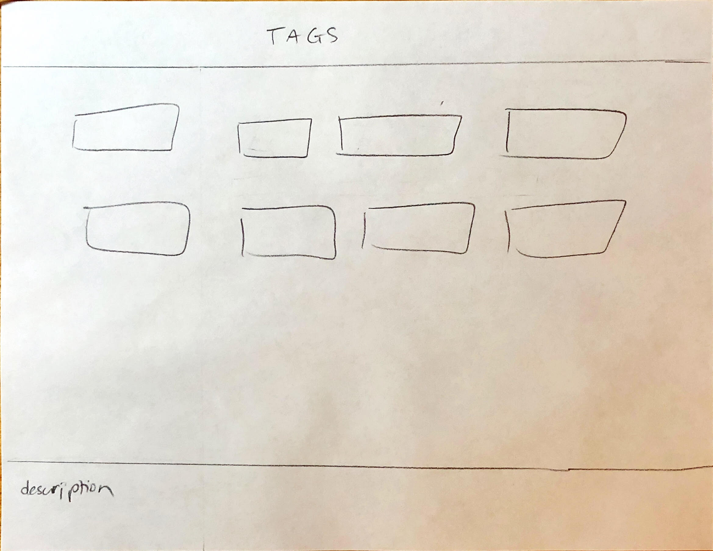

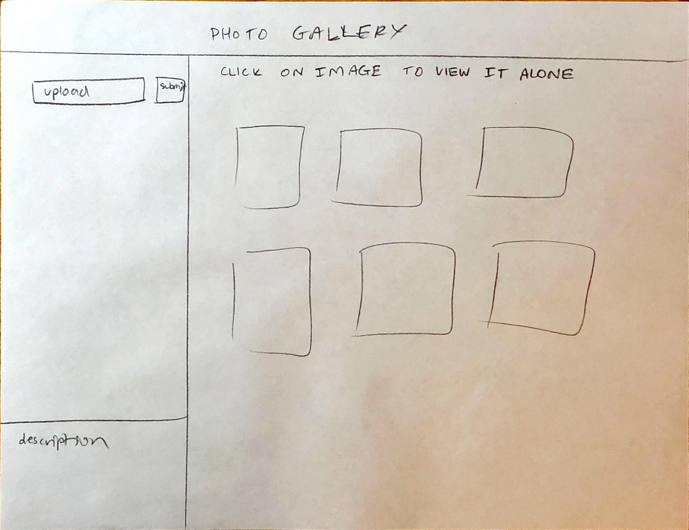

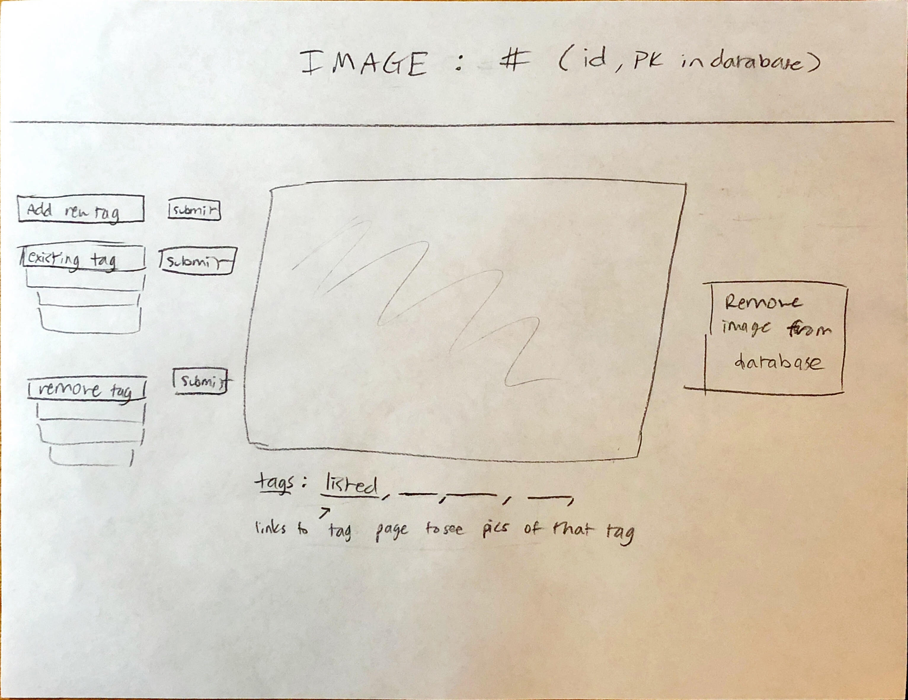

### Wirefames

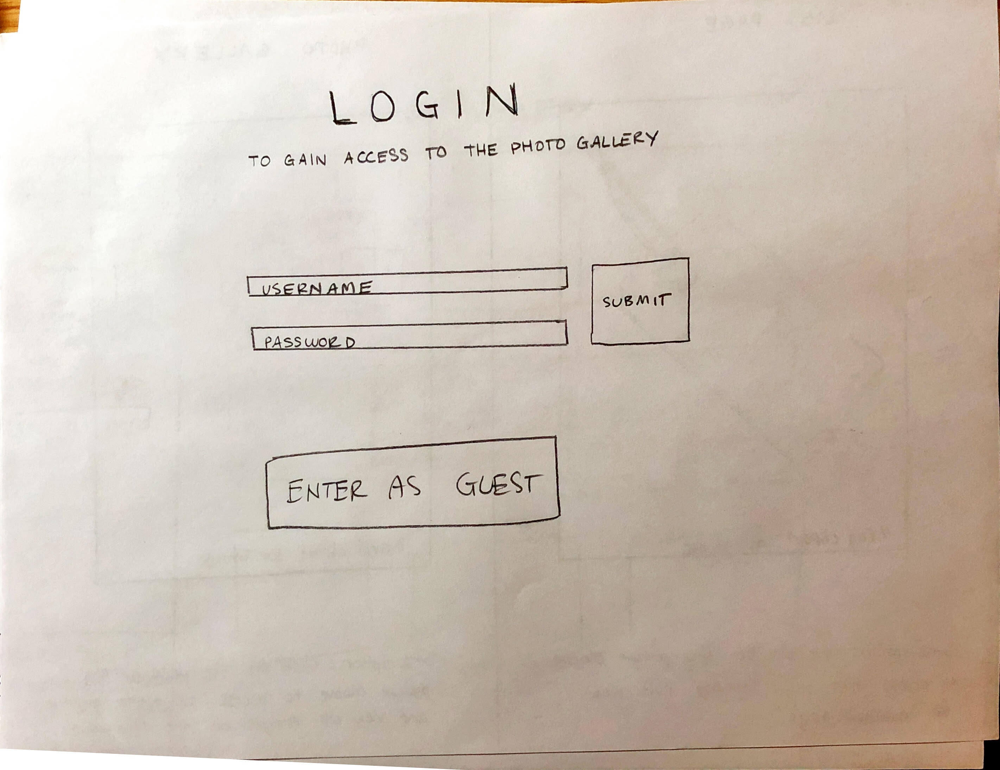

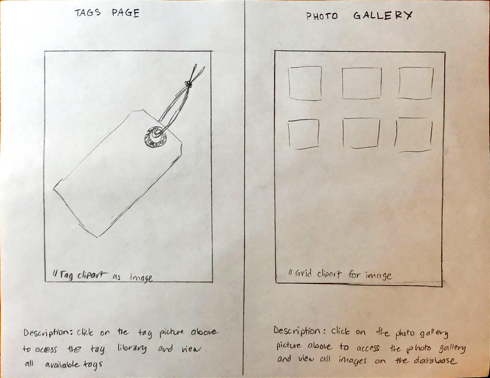

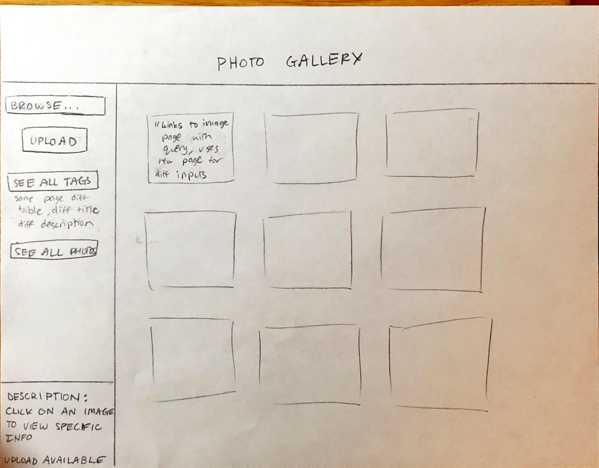

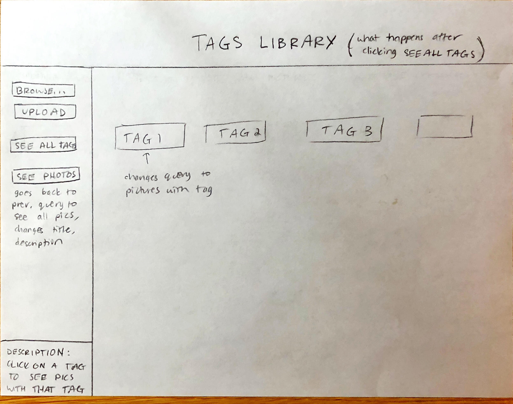

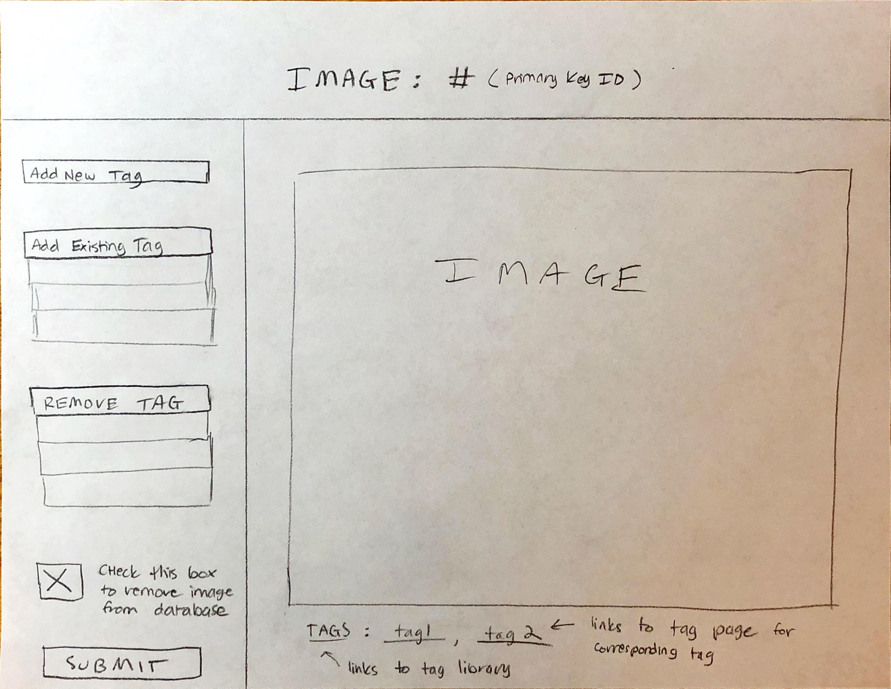

My design lets the user see every available option on the spot and gives them a better overall comprehension of how my website works. It also has convenient descriptions on pages that have a lot of inputs/links and has messages in case of errors. This gives the user directions in case they are lost.

## 3. Database Schema Plan

[Describe the structure of your database. You may use words or a picture. A bulleted list is probably the simplest way to do this.]

Table 1: login

   field 1: id (PK, U, NOT NULL, AI, INT)

   field 2: username(text, U, NOT NULL)

   field 3: password(text, NOT NULL)

   field 4: session(INT(0 or 1 after checking for login))

>You could also just have one table (login/users) that contains id, username, password, session.

Table 2: tags

   field 1: tag_id(PK, U, NOT NULL, AI, INT)

   field 2: tag_name(text, U, NOT NULL)

Table 3: photos

   field 1: pic_id(PK, U, NOT NULL, AI, INT)

   field 2: photo_name(text, U, NOT NULL)

   field 3: uploader_name(text)

>You are not allowed to use BLOBs.

Table 4: taglist

   field 1: id(PK, U, NOT NULL, AI, INT

   field 2: pic_id from Photos table

   field 3: tag_id from Tags table

>You should also include another id for each entry.

## 4. Database Query Plan

[Plan your database queries. You may use natural language, pseudocode, or SQL.]

Show all images : SELECT * FROM photos

Show all tags : SELECT * FROM tags

Show all images with tag : SELECT DISTINCT pic_id FROM taglist WHERE (tag_id = x)

Show all tags in image: SELECT DISTINCT tag_id FROM taglist WHERE (pic_id = x)

Show specified image: SELECT pic_id FROM photos where (pic_id = x)

>You also need login SQL and adding/deleting tags, images, and many-to-many relationships.

## 5. Structure and Pseudocode

### Structure

[List the PHP files you will have. You will probably want to do this with a bulleted list.]

* includes/init.php - stuff that useful for every web page.

* login.php - login page to access database

* index.php - selection page, tags or photo gallery first        

* phototag.php - photos and tags page where it      displays your query in table (like wireframe model)

* image.php - separate image page which allows adding and removing tags as well as deleting image from database, image query

### Pseudocode

[For each PHP file, plan out your pseudocode. You probably want a subheading for each file.]

#### index.php
```
Pseudocode for index.php...

include init.php

website title
divisions at 50% width
height at 100vh
images in each division that are links
descriptions at bottom of each division

```

#### includes/init.php
```

initialize database and create connection

header, footer

login session if username/pass correct(send a cookie to start session if so)

messages array to store messages
```

#### phototag.php
```
browse box shows images that can be uploaded
filters for jpgs, pngs, ... other image files

see all tags changes query to see all tags
see photos changes query to see all photos

images link to image.php to see specifics of each image
```

#### image.php
```
title: take image id and place it after "Image: "

add new tag box : filters input for text

add existing tag: checks that tag isn't already on the picture, drop down menu, filters to check that its text

remove tag: drop down menu with tags on the picture, get that from show all tags on image query

remove image from database checkbox, will remove the image id from photo and remove all instances of it from taglist

submit button: processes what has been done

taglist on bottom: links to specific tag queries and goes back to the phototag.php page
```

## 6. Seed Data - Username & Passwords

[List the usernames and passwords for your users]

* username :'seedData'
   password: '12345'

* username: 'info2300'
   password: 'infosci2300'

> ## Skeleton Website Feedback
> Everything looks good! Make sure you go to office hours/ask on piazza if you have any questions.
